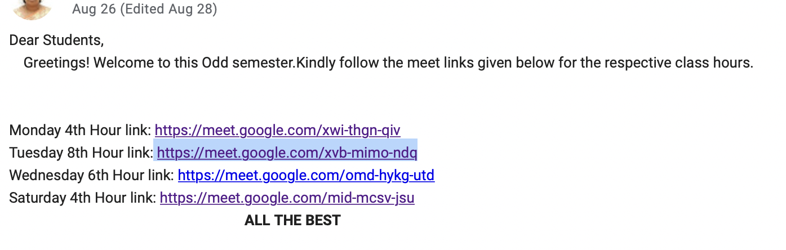

# GMeet-Automator

This is an Automator developed using Python's Selenium framework. This works effectively with Google Class Room

## Prerequisites

- Python 3.5 or above installed in the machine
- ChromeDriver.exe (has been added to this repository for ease of use)
    Download the right version of ChromeDriver from https://chromedriver.chromium.org/  
    For MacOS download the right version of driver and remove `.exe` extension in `functions.py` line `27`.
- Good Internet Connection
- Google Account (Mostly G-suite for schools and colleges, but yeah! personal accounts also works well)

## Running

1. Clone this repository.
2. Run the command `pip install -r requirements.txt` in the command prompt / terminal.
3. Configure the `TimeTable.txt`, login credentials, GCR links, Sleep time based on internet connection / Class timings.  
    In `functions.py` check the lines,  
        - `30`,`34` for login credentials  
        - `46`-`49` for class duration (Default: 1 - 2 hours)  
        - `116`-`136` for GCR links  
        - `104`,`112` for customized messages  
      The conventions in `TimeTable.txt` are to be followed to avoid errors!
    In `main.py` configure line `9` which iterates the function at regular intervals
4. After configuring, save the files and run `python main.py` in command prompt and `python3 main.py` in linux

## Working

1. Initially on the start of the program, the code checks for the current class from the `TimeTable.txt` file.
2. If there's a class, the Login function is invoked which opens the driver and login using the credentials provided.
3. Current class is passed as a parameter from which Google classroom links are retrived.
4. The program looks for the Google Meet link by means of,  
  - Hyperlink posted in stream / Dashboard of GCR.
  - GMeet link posted in stream in the format `meet.google.com/{code}`.
  - GMeet added as an event in the Google Calendar.
5. The page gets redirected to the GMeet page, joins the meet after muted the mic and turning off the camera.
6. Based on the configuration, the control stays in the meet for 1-2 hours exactly and leaves the meet (Should be updated).
7. On iteration, the program again checks for class and joins if exists.
8. Once all the classes are completed, the program terminates with a customized message.

Basically, run this code once a day and attend all the classes!

## Note
  If fixed links are posted in the stream but not scheduled as in the image, do add them to your Google calendar in order to avoid malfunctioning of the bot.  
  To add in Google calendar - refer https://calendar.google.com/calendar/  
  Add an event, check if it's scheduled weekly, edit the GMeet code and save the event.  
  
  

## Limitations

1. The Automator might fail if Google changes the site structure of GCR, GMeet.
2. `sleep()` can vary depending on the internet bandwidth.
3. Since this is a bot, 100% correctness can't be achieved.
4. You'll be caught if your teacher calls out your name.
5. You'll be the last person exiting the class if your class ends beforehand the usual (will be updated).
6. No GMeet link will be fetched if someother means than mentioned are implemented to post the link.

## Demo

[Click Here](https://drive.google.com/file/d/1SIw9qV4EpFiIqrt-vO0Mh04_boATR04S/view?usp=sharing) to view the demo video of the bot. 

## Troubleshooting

  Raise an issue if you face any inconvenience.
